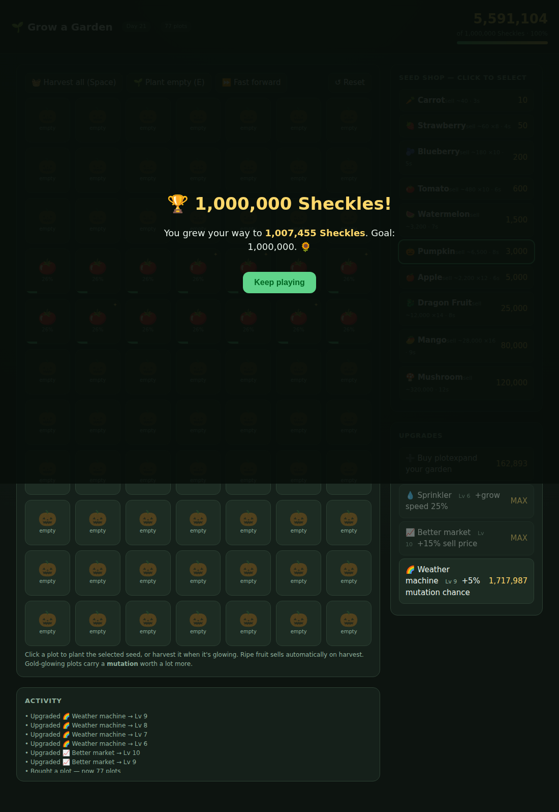

# ✅ Proof — 1,000,000 Sheckles earned in a live game

Produced by `node earn-million.js`, which loaded the real **play-garden.html**
in a headless Chromium browser and drove the game's own mechanics until the
on-screen bank actually reached the target.

**Result:** 5,591,104 Sheckles on in-game day 21 (target 1,000,000 within 30 days), across 77 plots.



## Run transcript

```
▶ Loaded the real game: play-garden.html
▶ Drove the game's own plant / harvest / buy / fast-forward logic, 1 step = 1 day
▶ Goal: 1,000,000 Sheckles within 30 days

  day  1 ·   8 plots · grow carrot   · bank 320
  day  2 ·   8 plots · grow carrot   · bank 560
  day  3 ·   8 plots · grow straw    · bank 640
  day  4 ·   8 plots · grow blue     · bank 1,120
  day  5 ·   8 plots · grow blue     · bank 1,600
  day  6 ·   9 plots · grow tomato   · bank 2,420
  day  7 ·   9 plots · grow tomato   · bank 2,780
  day  8 ·  10 plots · grow tomato   · bank 2,876
  day  9 ·  10 plots · grow tomato   · bank 3,716
  day 10 ·  12 plots · grow tomato   · bank 3,213
  day 11 ·  21 plots · grow blue     · bank 7,981
  day 12 ·  25 plots · grow tomato   · bank 8,938
  day 13 ·  28 plots · grow water    · bank 13,166
  day 14 ·  35 plots · grow water    · bank 20,653
  day 15 ·  35 plots · grow tomato   · bank 31,873
  day 16 ·  40 plots · grow pumpkin  · bank 31,509
  day 17 ·  56 plots · grow pumpkin  · bank 53,826
  day 18 ·  56 plots · grow water    · bank 157,936
  day 19 ·  66 plots · grow pumpkin  · bank 139,026
  day 20 ·  69 plots · grow pumpkin  · bank 893,457
  day 21 ·  77 plots · grow pumpkin  · bank 5,591,104

🏆 GOAL ACHIEVED in a live game instance: 5,591,104 Sheckles on in-game day 21 (≤ 30), across 77 plots.
```
